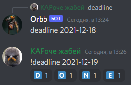

# orbbot

  

### description

lil bot for lil discord [QC](https://quake.bethesda.net/en) channel
---

### usage

Orbb can help:  
`map`      🗺️ Choose random map.
`profile` Show quake profile link `profile some_name`  
`pzdc`     Random character and team shuffle.
`spec`    Bot send vote message with question like: `Who want to play now?` If player, that set positive reaction, more
than 8, bot choose random spectators.  
`voice`    Shuffle members of voice channel to 2 teams and spectators.  
`vote`    Shuffle members who set positive reaction to 2 teams and spectators.  
`role`    show your roles & link to message where you can add/remove roles  
`bday`    show happy birthday users
`pzdc`    OMG mode! Random team and character. Prepare to suffer.  
`ping`    Used to check if the bot is alive.  
`help`    Shows this message and more info for commands.  
`poll` Simple poll with only 2 reactions (👍, 👎).  
`roll` 🎲 roll dice and set result as reaction on your command. Return number from 1 to 6.  
`random` Shuffle to 2 teams from message input.  
`deadline` Show deadline date for book club. To set the date use `!deadline YYYY-MM-DD`  
  
`slot`     Roll the slot machine 

#### info:
in `pzdc` & `team anything` command use emoji vote mode.
You need to react on bot vote message.  
example:  

|emoji| meaning                  |valid reaction|  
|-----|--------------------------|--------------|  
|✅   |positive reaction          |yes           |   
|❌   | negative reaction         |yes           |  
|🔟   | 10 seconds until vote ends|no (vote info)|  
|5️⃣   | 5 seconds until vote ends |no (vote info)|  
|🛑   | voting is over            |no (vote info)|   

---

### setup

to run this bot, you need to set environment variables:  
`TOKEN` - [discord](https://discord.com/developers/docs/intro) bot token  
`TENSOR_API_KEY`- [gifapi](https://tenor.com/gifapi/documentation) token  
`PREFIX` - Command prefix to use

---

### deploy

[configure your bot here](https://discord.com/developers/applications/)  

  
[invite link](https://discordapp.com/oauth2/authorize?&client_id=757854688518602773&scope=bot&permissions=1275591744)  
Wanna new features? [Create an issue](https://github.com/rvalien/orbbot/issues) on this repo.  
